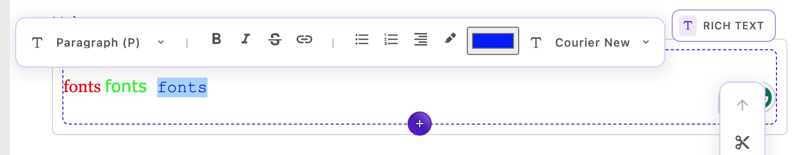

**TODO:** Update the badge URLs for the new module's repo.

<div align="center">
  

  <h1>Rich Text Enhancement</h1>
  <p>
    <a aria-label="Apostrophe logo" href="https://v3.docs.apostrophecms.org">
      
    </a>
    <a aria-label="License" href="https://github.com/apostrophecms/module-template/blob/main/LICENSE.md">
      
    </a>
  </p>
</div>

This bundle of two extensions is designed as a temporary workaround to add colors and fonts to text in the rich text editor. This should only be needed until the existing widget is patched and/or extended.

## Installation

To install the module, use the command line to run this command in an Apostrophe project's root directory:

```
// TBD
npm install 
```

## Usage

Add the bundle and individual extensions in the `app.js` file:

```javascript
require('apostrophe')({
  shortName: 'my-project',
  bundle: [ 'rich-text-enhancement' ],
  modules: {
    'rich-text-color': {},
    'rich-text-font': {}
  }
});
```

These enhancements can then be added to the project-wide or individual area rich-text-widget options.

Per-area example:
```
//...
fields: {
    add: {
      main: {
        type: 'area',
        options: {
         widgets: {
            '@apostrophecms/rich-text': {
              toolbar: [
                'styles',
                '|',
                'bold',
                'italic',
                'strike',
                'link',
                '|',
                'bulletList',
                'orderedList',
                'alignRight',
                'highlight',
                // add the color picker to the toolbar
                'colorButton',
                // add the font selector to the toolbar 
                'fontSelector'
              ],
              styles: [
                {
                  tag: 'p',
                  label: 'Paragraph (P)'
                },
                {
                  tag: 'h3',
                  label: 'Heading 3 (H3)'
                },
                {
                  tag: 'h3',
                  label: 'Heading 3 (H3) - Custom',
                  class: 'centered'
                },
                {
                  tag: 'h4',
                  label: 'Heading 4 (H4)'
                }
              ],
              insert: [
                'table',
                'image'
              ],
              // Add font selection - these need to be made available 
              // from your stylesheet or system fonts
              fonts: [
                {
                  label: 'Arial',
                  value: 'Arial'
                },
                {
                  label: 'Courier New',
                  value: 'Courier New'
                },
                {
                  label: 'Georgia',
                  value: 'Georgia'
                },
                {
                  label: 'Tahoma',
                  value: 'Tahoma'
                },
                {
                  label: 'Times New Roman',
                  value: 'Times New Roman'
                },
                {
                  label: 'Verdana',
                  value: 'Verdana'
                }
              ]
            }
          }
        }
      }
    }
//...
```
